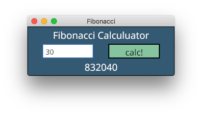
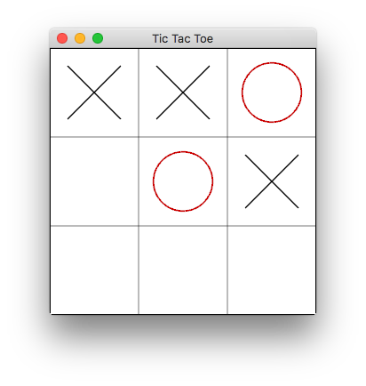

# conrod-examples

Very simple example applications of [conrod](https://github.com/PistonDevelopers/conrod).

Initialization and event loop code are mostly taken from [conrod's examples](https://github.com/PistonDevelopers/conrod/blob/master/examples/support/mod.rs).

## Building

```sh
cargo build --all --release
```

## Running

```sh
cargo run -p fibonacci --release
```

or directly execute binary:

```sh
./target/release/fibonacci
```

## Application

- `fibonacci`



- `tic_tac_toe`



## License

- [MIT](https://opensource.org/licenses/MIT)
